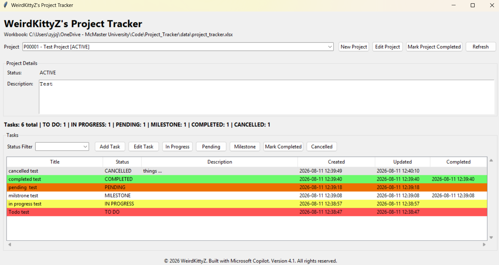

# WeirdKittyZ_Project_Tracker Version 4.1

This is a Project Tracker Python GUI.

## Install for Windows
- Download the _.exe_ file from **Releases** on the right side of the screen
- Once you run the  _.exe_ file, it will create a data folder for you, and the GUI will store and read data from this folder. (**this excel file contains all of your data, DO NOT delete**)
## Install for others
- Download the GUI folder
- Run _main.py_ 

## Remark
My code is like a three-legged horse, it is not a fully functioning horse, but it can run :smirk_cat:

This code is created with extensive help from AI.
